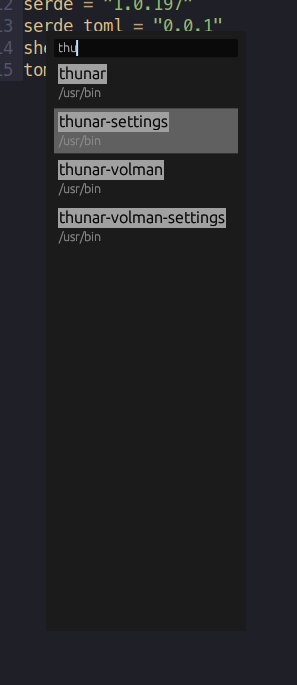
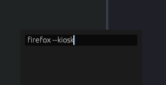

# URun

A small[^1], simple utility for launching applications from the desktop, designed to be used from WM keybindings, E.G. using `Sway`:

```shell
    # URun launcher
    bindsym Mod4+x exec urun
```

It scans your `$PATH` directories for executable files and presents a list of suitable candidates as you type, which you can navigate through with `<C-n>` and `<C-p>` (or `<TAB>` and `<S-TAB>`) and select (run) with `<RET>` or `<C-y>`.



Arbitrary commands can also be entered and launched:



A short log of past commands is kept in `$XDG_CONFIG_HOME/urun.toml` -- delete this file to clear the history. At present this is the only "configuration" supported. Command history can be browsed with the up and down arrow keys or, in theory, `<M-p>` and `<M-n>`, however, cursor position in the input line is currently at maximum jank when using these keybindings.

## Compatibility

Because I wrote this for myself to answer my own needs, and as a way to learn Rust, I've not tested it on or considered any system other than my own, but in theory it should work on any unix-like OS where it compiles and [egui](https://github.com/emilk/egui) works. If someone does find this useful and it turns out there is a problem I'd be happy to try to sort it out if only as a further opportunity to learn.


[^1]: Or not; it's 15M when compiled in release mode on my machine, and takes a surprising amount of memory as well.
